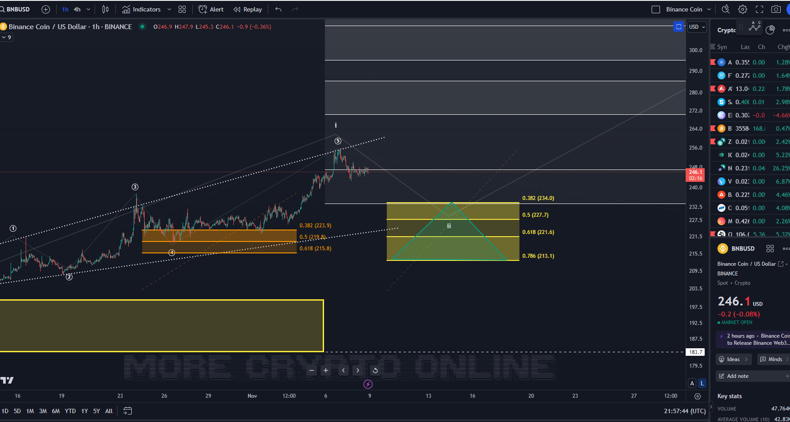

# First Steps

## MCO ELLIOTT WAVE TRADING TIPS +++
```
As a lot of new members have joined us, I have put a small article together that can give you some initial guidance. Please also watch the Welcome Video and read through the material we have provided in the Discord Channels.

The colored zones are always areas to consider for adding positions, but it always depends on your personal plan. They are there to provide waypoints in your plan for your portfolio.

The boxes represent a specific 'typical Fib' area and serve as support. However, what one does tactically is a question of their own risk tolerance, positioning, and trading skill.

Imagine a triangle for scaling in your plan. The width of the triangle corresponds to the position size. You have to interpret what is the right scale for you. So place some orders along the triangle and a stop below the box or below the invalidation level, which is a bit further away. As the price rises, set staggered exit orders. The triangle is not exact. I just slapped it together quickly, but it exists alongside the boxes. Then, as the price rises, roll a stop up with the price.

For example, Binance Coin (BNB) also had a possible entry in the orange box at the end of October. It's always a question of the timeframe as well—some prefer to trade the daily charts, others the hourly ones...

Sometimes the coins turn a bit above the support zone; that's just trading. Hence the idea with the triangle. You can decide for yourself whether to enter with a small position just above the zone.

Often, they do get picked up. I always choose my words carefully; I can, of course, be wrong sometimes or overlook something, but fundamentally:

```


```
What I so like to teach everyone is that it should not matter to anyone what I think because the market doesn't care about my opinion. What's more important to me is to stay in the "if this, then that" mindset. Analyses are always based on conditions. If I say I tend to think that the market might drop again, that's a possibility, but only IF a certain support breaks. It may seem later as if I made a prediction, but I'm more about finding rich, low-risk setups on both ends of the market. That means the charts and Fibonacci levels are objective. If the market runs into a zone, we have an attractive setup. But just because I think it might happen doesn't mean it will. Often, it does, but these are only probabilities. In the end, you can always measure your risk at the boxes. That's objective, and that's what matters.

It's best to look at the support and resistance levels on my charts, not my opinion, simply because you must make your own assessment of the risk.

Technical analysis should be based on "if-then" conditions, which provides a structured approach to predictive analysis; anything else is just a guess or prophecy.
Elliott Wave offers various, sometimes conflicting interpretations. Although it provides some predictability, the predictive power varies depending on the pattern. Impulses are predictable. Corrections, less so. What do we do with these conflicting viewpoints? We must identify the most reliable support or resistance levels to position ourselves.

Buy support with a stop below it. Short resistance with a stop as well. Sometimes, the best thing to do is to stay still and wait. Always watch the size of your position. Ultimately, that's what we can truly control in trading.

Taking analysis as a simple prediction is the wrong approach and will leave you frustrated. Look for the pivot points the analysis reveals.

It's often a misconception that every twist and turn in a price chart should be traded. Most price movements do not require any action from a trader. It's not necessary to react to every market forecast or signal provided. While it's my job to share my perspective on potential market directions—whether daily, weekly, or monthly—not all forecasts carry the same weight in terms of likelihood or as trading suggestions.

My task is to interpret the market's potential moves and to highlight advantageous setups. Your task? To discern which of those interpretations translate into trades that match your strategy and risk profile.
```