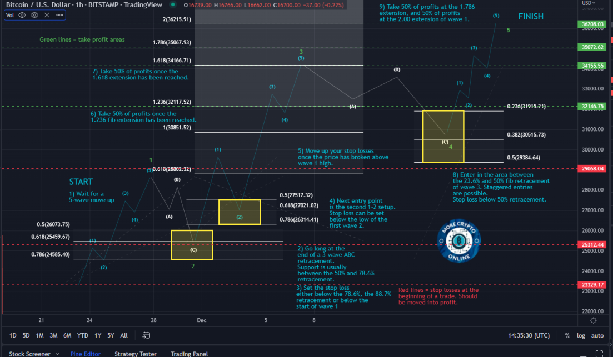

# Getting Started

Welcome to MCO!

I would like to personally welcome you to the More Crypto Online membership. 

As a member of this service, you will receive access to a fantastic community, learning material about cryptocurrencies, trading and technical analysis, a weekly live stream and much more. The exact services you receive depend on which membership you selected.

As you may be new to Elliott Wave analysis, I would highly suggest you take this opportunity to go through the "getting started section", especially:

1) the tutorial videos and live streams we have on Elliott Wave patterns and strategies, as well as Fibonacci retracements and extensions
Links:
https://www.morecryptoonline.com/technical-analysis
https://youtu.be/SYxnPSWfT3Q (Elliott Wave trading strategies)
https://youtu.be/SiadUSfBYas (Elliott Wave trading strategies II)
https://youtu.be/X44nRKSJaPM (Elliott Wave trend trading)
https://youtu.be/oRfTdumxlNU (Elliott Wave and MACD)
https://youtu.be/jg_0siSBtOw (Elliott Wave and RSI)
https://www.youtube.com/live/C8N6WRJFLA8?feature=share (Elliott Wave and Moving Averages)
https://www.youtube.com/live/eFQUPHyOBec?feature=share (Elliott Wave channelling technique)
https://youtube.com/live/JntungwNQPU (Futures Calculator & Risk in a Trade)
https://youtube.com/live/WOnhNbfKjj4 (Elliott Wave fib relationships)

2) the suggested learning path .pdf file, which gives you a roadmap through our learning material
(see attachment to this post)

3) the tutorial live streams about the correct trader mindset. When it comes to being profitable, mindset is more important than charting.
Links:
https://youtube.com/live/KLWzKgYG1SI (Trading mindset I)
https://youtube.com/live/xvDElEPxD3c (Trading mindset II)

Also read through this getting started section for further information about how you can use our analysis for your benefit.

This is not a simple signals channel. We provide education, the community and technical analysis services. While the content we offer may seem overwhelming at first, and while Elliott Wave is an advanced concept, I will assure you that it will transform the way you think about investing and trading as soon as you begin to understand how markets really work.

If you have any questions, I encourage you to post them in the general chat room, as many community members are willing to support. You can also reach out to the support team by sending an email to support@morecryptoonline.com.

Again, welcome!

Ben 

## HOW TO UNDERSTAND OUR ANALYSIS:

This post is designed to help you understand how to place Elliot Wave analysis into the proper context, so that you can benefit most from this tool and our analysis.

While Elliott Wave is quite an advanced concept and it can seem overwhelming at first, I assure you that the way you think about trading and investing is going to change once you understand how markets really work. There are many methods of technical analysis, but the advantage of the Elliott Wave method is that it works in basically every market, as it is based on measuring human sentiment, and this is the same in each market.
I occasionally get comments that Elliott Wave analysis is suggesting that “the market is either going up or down.” Unfortunately, anybody who views the analysis in such a simplistic way is completely missing the point of how the analysis and how markets work, and it excludes them from benefitting from the analysis.
It is important to understand that markets are not static, and any technical analysis has to take into account that the context is constantly changing and new price patterns are unfolding and transforming. Because of this, my analysis, and really any Elliott Wave analysis, is based on an “if/then” perspective.
Anyone using our analysis would do well to make sure they have a good understanding of the logic of if/then statements. As there are often misunderstandings, I want to provide some examples.
“IF another car crashes into my car while I am driving, THEN I may get injured” is a great logical if/then statement. This does certainly not mean that I am sitting at home, avoid driving just to avoid that another car hits my car. Actually, it does not say anything about the probabilities of such an event. It only highlights a causal relationship, AFTER the IF condition is met (and only then). The probabilities for the IF condition can be very small and will vary depending on where I drive my car, when and how, but in the event if this does happen, implications are significant.
The same is true for markets. I often say that I am focused on the upside as long as certain price levels hold. However, IF a certain level is broken to the downside, it will change my view. This does not imply that I see a break of the level as the likely scenario. Yet, in the event if the breakdown occurs, it reduces upside potential and may even invalidate a certain wave count, which forces a change of perspective. Important to understand is that such a break of support will lead to a new scenario with a new if/then logic. For example, IF price can break resistance again, THEN upside expectations are in play again.
Setting stop losses is a personal decision, as where a stop loss is set depends on the personal portfolio, portfolio risk, how much the trader is willing to risk in a single trade, and some other aspects. However, I can say that anyone who follows our analysis should at least consider to use the IF levels as relevant and to set stop losses above or below them (depending on if we are in an uptrend or downtrend), because these are typically levels where probabilities shift. 

This post should explain why I use if/then statements when presenting the analysis and will also be a suggested read for new members to provide some context.
///////////////////////////////////////////////////////////////////

## IMPORTANT TO KNOW ABOUT RISK MANAGEMENT:

We want everyone here in the MCO community to become successful. However, we also need everybody to understand that markets are dynamic and complex systems. They are fluid and always in motion. To successfully operate in such systems as a trader, it is crucial to develop the skills and experience that is necessary to navigate in this space. The crypto space is a very young space and usually more volatile than the stock market, for example. This adds risk and also adds an element of additional uncertainty. Therefore, we strongly suggest that you take the time to learn about Elliott Wave and trading, about technical analysis and risk management and all related aspects before you begin to trade. Ultimately, you risk your hard-earned money when you trade. 
This server is designed to offer some guidance and educate about the Elliott Waves. It is designed to become a knowledge base that will add incredible value to this community in addition to the announcements, live streams, signals, etc.

Unfortunately, we have seen too many inexperienced traders to jump in with both feet without the needed background or experience. This is the easiest way to blow up your trading account, so we caution against it. Also, our general view is not enter any trade with more than 2-3% of the size of the trading account and ALWAYS use stops. Not to use a stop loss is extremely risky. It can work with the appropriate strategy, but as a general comment stop losses are recommended. 
//////////////////////////////////////////////////////////////////

## ABOUT DIFFERENT TIMEFRAMES:

We recognise that many community members see themselves as long-term investors and not short-term traders. Of course, we also have many short-term traders in the community, but due to the interest in different time frames we also provide technical analysis updates on several time frames.
Every other day or so, I therefore show a longer term outlook for BTC, and irregularly update long-term charts for other coins, too. These, however, do not change that often, and therefore do not require to be updated that frequently. In order to avoid repetition, we have created a long-term chart video playlist on Youtube, which is updated regularly. Here you can find videos in which I highlight all-time high targets of different coins. I typically show the long-term chart first in these videos, so that you can find it quickly if you need an update about all-time high targets or a long-term outlook.
You can also use our Tradingview charts, which often include the entire chart history of a coin. For some specific coins we have separate long-term charts. 
However, all of this is only going to help you if you know what kind of market participant you are. Only you can find that out. Based on that you can then focus on the segment of the analysis that is relevant to you.

This is the link to the long-term chart video playlist:
https://www.youtube.com/playlist?list=PLU662-7pBwrl84hs9Q8ES2KoPCTviFm51

/////////////////////////////////////////////////////////////////

## ABOUT MCO WORLD / HOUSEKEEPING:

### Some important points regarding housekeeping:

- every Sunday at 5pm UTC we carry out the member live stream. Recordings will always be available and in the live stream section are all the links and a document that includes all links and topics
- early each week we post a poll on Telegram with proposed live stream topics. You have a vote and can decide what we cover!
- every Monday is "Mindset Monday", and I post something around mindset, as it is so important to being profitable
- every week (there is no defined day) I publish an Opportunities Video for members only. The links can be found in the "altcoin videos" section and when it is released, it will be posted in Announcements
- several times per day we post short-term market updates and signals for Gold members
- you have access to all Tradingview charts, and you can access them through the links in the Tradingview charts section here on Discord
- keep an eye on the Announcements channel, as all important updates are posted here
- have a good look around on Discord, and check in regularly as we constantly add valuable content, so that the value of the membership grows constantly
- you can make requests for coins in the relevant section on Discord, but we cannot guarantee that we cover them. We use them to get an idea which coins the majority of community members is interested in, but coin requests are not an official extra of the membership. However, of course we listen!
- if you are interested in further education, then check out our video trading course on www.morecryptoonline.com
- much more exciting content is planned, and we improve the membership constantly
  
/////////////////////////////////////////////////////////////////

## WHAT IS ELLIOTT WAVE, AND WHAT IS IT NOT:

For the benefit of many new members and also many of the MCO veterans here, I think it is worth reminding what Elliot Wave is and what it is not. I am pretty plain about it.

The Elliott Wave method performs extremely well when the market provides clean impulsive structures according to its rules and guidelines. When that occurs, we have a very nice roadmap from which to develop a trading plan: where to enter, where to exit, where to take a loss, and where to take profit. I cover 20, 30, sometimes 40 charts. I could not do that without EW analysis. If I was using standard technical analysis, I would have to develop a very bespoke view on each. The reason is that with standard technical analysis, not every method works on every chart. I know that all too well from developing and testing strategies across different asset classes over the years.  Standard technical analysis is also quite weak in projecting targets, which Elliott Wave and basic use of maths and fib levels do very well. Elliott Wave analysis allows a quick roadmap view from which one can make key decisions and develop a plan. 

However, many charts just don't move impulsively, or they may only do for short periods of time. I'll call those charts 'unclear' from an Elliott Wave point of view. Examples are lifetime downtrend charts or just range markets. Unclear charts are not necessarily bearish. But it does mean that Elliott Wave, applied on these charts, does not give us a clear roadmap. In the past, when I was learning about trading and different markets, I tried to apply all sorts of technicals. My trading was wildly profitable in some years, and in other years it was a loss. As I started to use EW more and more, that changed. 

A key part of that is not jumping very hard into unclear charts, even if it means missing some big moves. Some members ignore my 'unclear' comments, and that`s fine. Some members do well by applying other insights I don't have the luxury of time to develop with so many charts, and that is great as well. I'm not here to tell you what to do. But I have seen more and more members, especially those that want to learn, come around to focus more on risk management. Those that are always looking for the big trade and over risking, generally blow up. I have blown up my account back in the day around the 2008 banking crisis. I was stubborn and did not know too much about trading. Eventually I started to focus on steady growth of my portfolio instead of looking for the "one" trade that would make me "rich", and had to be honest with myself. I needed to change if I'm going to make it. I can say that day resulted in a giant change not just financially but emotionally. I have mostly achieved that goal, but I still have work to do.

This is something to think about on your journey.

///////////////////////////////////////////////////////////////

## READ THIS ABOUT WHAT MARKETS "CAN DO", "COULD DO" or "SHOULD DO":

Very frequently, I receive questions that contain language like "is it possible that.....", or "could it be X or Y". The assumption has to be that markets can do anything and so the answer to such a question is generally "yes". This is of course a useless answer. I strive to give you what is the most likely outcome. In the process to get there, I have to look at many solutions to the chart and count, discounting the improbable. I only present the reasonably likely counts. Of course, even within the reasonably likely counts, there are more or less likely ones, but of the counts presented, one typically works out. I normally do not just say "yes" to your question, as it is not helpful on your learning path. Most of the time, I try to take the time to show why something is not probable if I have time. Note please that making every one of these questions and posts a full teaching moment is not possible.

Take this the right way: these questions are very dangerous if they come from a bullish or bearish bias. Are you long and looking for a reason to stay in your position even though it is going against you? Try to fight that urge. Trade what is probable, not possible. It will save you money for sure, and likely make you money. 
///////////////////////////////////////////////////////////////

## SETTING EXPECTATIONS / PERSONAL ADVICE AND RECOMMENDATIONS:

Recently I have been receiving more and more direct messages to give advice on specific trades or to help people who lost money. I tend to ignore these.

The setups are basically on the charts or in the signals group if you are part of it. Answering questions about strategy or specific entries can put me in regulatory jeopardy. It is too close to making personal advice. I also endeavour to teach on strategy so you can form your own plan. So, if you ask me a strategy question, I'll generally say 'reasonable' but you give more questions to consider so you can work on your own plan. I recommend to watch the live stream we did on trading Elliott Wave, it might explain my strategy. I tend to see pullbacks in trends as opportunities. But the question of buying or selling relates to your previous trading decisions as well, your cash flow, emotional state, portfolio, etc., so it is actually impossible to give advice without knowing those factors. Besides this, I am not allowed to.

Besides this, I am handling tons of charts and do my own trades. It is a ton of work and basically impossible to provide personal advice. And even if I had the time, I would not be allowed to. 

Also, if someone has a question, please post it in the chat. At least then the majority of people can benefit from my reply or the reply of others. 

I can't legally make recommendations in response to a direct question like that because it is interpreted as personal. But the answer would be loaded anyway. I don't know you as a trader which includes skill, and emotional leanings. 

Trading and analysis are two different disciplines. Of course they are joined at the hip. The pure analyst just looks at structure and probabilities. But the trader should not just look at 'up' or 'down' but has other inputs: positioning size, total portfolio exposure, and personal success rates viz a viz timeframes, etc. That's to say every individual needs to find themselves and their personal sweet spot working with my analysis.

My analysis is meant to create pictures across a few time frames. How you play it is individual, and takes a lot of thought and practice. But we are all here to help develop those muscles in everyone. But that doesn't change the fact that both aptitude and hard work by everyone affects outcomes.

This file explains the rating of our trade setups and the relevant colors.

## AN IMPORTANT POST ABOUT RISK MANAGEMENT, POSITION SIZING AND STOP LOSSES:

This is a post I am writing in preparation for Sunday`s Live Stream which may cover risk management. This article outlines my thoughts and experience with risk management, and it particularly focuses on position sizing. As it is going to be a long one I will give you time to digest and post it in several parts over the coming days.

I am going to start with a very important point. Many new traders spend a lot of time to try to get a directional edge in markets, which means they strive to learn if a market is likely going to go up or down. One way of doing this is to learn technical analysis. Another way of doing this is to join MCO. The problem is that many do not have the patience to thoroughly test a method and explore it fully. Many also move from method to method, from indicator to indicator, from service to service, while trying to find that one method or service or analysis that gives them all they need. Some people will find what they need, but will be too emotional to use it properly. 

The plain truth is that you need only a 51% directional edge to make a consistent income with trading. But if you understand the point of this post, then you can get away with less than 50%. So, if your account suffers and you are not profitable, then you should read further.

The point I make here is that directional edge is important, but it is only one aspect. If you neglect the other aspect I highlight, then you can still easily blow up your account even if your feeling about or analysis of the market is super accurate. What you should be looking for is “positional edge”. This relates to your ability to limit your losses while you can seek and maintain a reward that outweighs your risk on every single trade. 

So, what does the term “directional edge” actually mean? It is what most people look for when they listen to a technical analysis. It is basically about being right about the direction of the market (e.g. up or down or sideways range). What does the term “positional edge mean”? It means to look only for trades in which your risk is minimal and the reward as high as possible.

Many of you have been here since the early days of MCO, and have been here when I was calling for a below $29k BTC price, and I was able to do this already in December 2021, very early in the bear market. Another example when I was “right” was around March 10th of this year when I posted about the market being close to the end of its correction due to the negative news (that often only appear at the end of wave 2 corrections) and an oversold RSI on the daily timeframe. These calls are what many are looking for and thats fine. It is often what makes an analyst popular, and it is always a bit dramatic. Many of these calls get people into the service. And it is the Elliott Wave method that allows me to make calls like these. And whats great is that Elliott Wave also gives us clearly the levels that will make a scenario invalid, and Elliott Wave tells us when we have to change our perspective. And of course, I am not always “right”.

What is often neglected, even though it is so important, is Elliott Wave`s ability to provide this positional edge. If you can trade setups that generate a very favorable reward to risk ratios, then you could even lose 70% of your trades and still be profitable, even though it should be straightforward to win more than 30% of your trades.

So, the conclusion is, and I have often explained this, to use Elliott Wave not only to know what trades to take, but let it guide you about how big your position should be and when you enter the market. As you know from my Elliott Wave analysis: Elliott Wave offers quite clear and objective levels. I often outline the 78.6% retracement in a wave 2 as a level below which the setup is likely to break. I tell you when a broken support opens to the door to more downside, or if something becomes less clear. Use that information wisely.
In addition to this it is useful to use good money management rules when you put your trading plan together. For instance, you need a rule that will define how much you are willing to risk in a single trade. An example is that you tell yourself: “I do not want to risk more than 1% (or 2%/3%) of my account in a single trade”. I personally recommend such an approach. If you do this, then you have quite clear levels to work with through Elliott Wave. 
With that defined stop or cap at what you are willing to risk, you have the potential of a trade with directional edge, as the Elliott Wave method defines five waves as the start of a trend. And, you have a clear stop that you can use to adjust your position sizing (positional edge). 
A lot of traders focus on the “reward” side far too much. Examples:
“Which one is the coin that will perform best in the next bull run?”
“$125K Bitcoin price in the next bull run? I go all in.”

These questions or sentences show two common misconceptions:
1)  It is assumed that the Elliott Wave method is always right. Elliott Wave is “right enough” to make many trades and be successful on a continuous basis. BUT markets are dynamic and volatile, and human analysts also miss details or make mistakes. 
2) It is assumed that risk management is not so important. Simple math, which allows you to calculate your risk in a single trade is neglected.
Elliott Wave offers clear stops, roadmaps, and targets. But unless you learn to use those levels and the information from the analysis to your benefit, for example through keeping the largest of your positions as close as possible to the stop, then you may get angry, emotional and frustrated. You may get angry at the market (the “manipulators”), at Elliott Wave or even myself. I am not responsible for your losses, though, as I cannot control how you position beyond what I teach here. That part is up to everyone individually. Therefore, there is also not a “right” stop loss level. There is no ultimate level on the chart at which a stop needs to be set. A stop loss level should be determined by a technical level on the chart, but also by taking into consideration how much you are willing to “risk” in a single trade. In some instances it may make sense to give a trade “more space”, but then the position size should be lower, based on your 1%/2% or 3% guideline. How much you are willing to risk is an individual decision, and will be determined by your personal situation, your cash flow and risk appetite. But note that risking more than 2% or 3% in a single trade significantly increases the risk of blowing up an account. It should never be a single trade that makes a huge difference to your bank account. It should be the disciplined application of rules so you can be successful on a continuous basis.

## AN IMPORTANT POST ABOUT RISK MANAGEMENT, POSITION SIZING AND STOP LOSSES (part II):

It should now be clear that position size is key. A good start is to figure out how much risk I'm willing to take on a single trade / position / idea. Find out what is right for you. I quantify this risk in terms of % of portfolio size and this number should be quite small. 1%-3% is a guideline. It can of course be smaller. 5% would be huge. 0.5%-2.0% range also makes sense for many people. The % refers to the risk per trade before getting stopped out, not to the entire position size. If you're already way above that size then your emotions may be pointing you in the right direction. Emotions give you feedback. If you are emotional about any trade result then this indicates that your position sizes relative to your stops are too big to be sustainable.
If you are emotional and your trades and your position sizes are too big, then it may be reasonable to explore sizing down to a position size and level of risk that allows you to maintain discipline, which means you can stick to your trading plan.

Again, no trade should risk more than 1%-3% of anyone`s account in my view, and that relates to the risk to the stop (or support/invalidation point). In terms of risk management, please refer to the pyramid strategy I shared before. It is just one way of doing it, and there is not the single “right” way of doing it. But initial entries when scaling into support could be very small, until the trade proves to work. Sometimes it means accepting less profit if it just goes. 
I believe a goal should be to achieve a smooth equity growth that isn't stressful. Overpositioning is the recipe for an account blow up. 
This relates to the risk in a trade/idea/etc. If we zoom out you of course have to consider your allocation across assets. If you are heavy into altcoins, and you have basically 30 long trades open on similar trade setups on similar altcoins, then, if one trade goes against you, chances are a lot of other trades will too, and you suddenly risk 30% with 30 trades open that risk 1% each. This is related to diversification of course, which is another aspect of risk management. 
Eventually, it is of course up to you how you put it to work. 

### OUR MISSION STATEMENT, VISION AND VALUES:

## ABOUT TOKENOMICS:
You know the whole 'tokenomics' concept that's been making rounds? Don't get me wrong, it's a great concept on paper. It tries to create a system where a token holds value, has utility, and does some smart stuff like limiting supply or enticing staking. But let's take a step back and think about what's really happening.

Tokenomics does not affect a token's price directly. I know, this sounds different to what you typically get told by many altcoin fans and by what is being communicated on Crypto Twitter. But let me tell you, you need to think different than most people out there. That is the advantage of being in the More Crypto Online community. The truth is, it's all about belief. If folks believe certain tokenomics are solid, the hype train starts and prices jump. But that's sentiment at play. That's exactly what we're tracking with our Elliott Wave analysis. It's the crowd psychology that dictates the trends. The problem is that there is no hype train in a bear cycle, despite tokenomics.

But here's where it gets even more interesting. In a bull run, it's true that many altcoins might outperform Bitcoin. But that doesn't mean all of them do, and it certainly doesn't mean they're fundamentally strong. In fact, no amount of good fundamentals has ever shielded any coin from a market downturn. Only ETH stands as a slight exception, and no altcoin has ever outshone BTC in the long term. So what does that tell us? The hype, not the fundamentals, is what drives the crypto prices. This is why the concept of fundamental analysis in crypto is flawed and misunderstood.

And, let's face it, adoption and lockup aren't foolproof strategies. Any price pressure can cut adoption, and a lockup can cause a supply waterfall effect. Just look at this bear market. It didn't spare even the projects with the 'greatest fundamentals'. That's the harsh reality of the market dynamics. And to top it off, developers, who are often paid in tokens, might decide to leave if the token prices take a nosedive. That is why projects do not get developed in bear markets. It is also the reason why altcoins can die in bear cycles. It's a harsh truth but price controls the rhythm of development in many cases.

Consider Uniswap, one of the largest defi projects. Its tokenomics linked adoption to supply to boost value. But, if tokenomics really worked, why isn't it much higher in value? Because, tokenomics, in essence, is a fancy term with limited real-world impact. It might be a hard pill to swallow, especially for altcoin fans, but it's the truth.

So here's the fact: Don't get hypnotized by the fancy tokenomics narratives. Knowing this allows you to see clearly. Tokenomics do not matter in the bull market and they do not matter in the bear market. What really matters is the hype and the sentiment. Always stay present, stay informed, and don't get lost in the herd. In the end, only one thing is clear – in the grand scheme of things, hype and sentiment are the real kings. So let's focus on that, keeping our heads clear, our analysis sharp, and staying ahead of the game.

## How to carry out a trade with Elliott Waves?
1) Follow the blue steps from 1-9, these guide you through the process, the entering and profit taking
2) Lines in red are areas for stop losses at the beginning of a trade. The blue descriptions refer to these.
3) Lines in green are take profit areas. Again, the blue descriptions refer to these.
4) The yellow areas refer to entry areas. Entries in these areas can be staggered (e.g. 3 entries per area, at each fib level)
